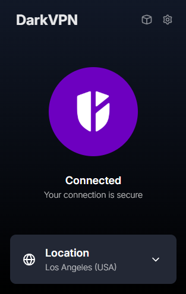

# DarkVPN: Анонимность и Скорость в Каждом Байте

DarkVPN — это не просто VPN-расширение. Это ваш персональный щит в темных водах интернета, обеспечивающий бескомпромиссную скорость, надежную анонимность и непревзойденную простоту использования.

## Ключевые Преимущества

*   **Молниеносная Скорость:** Мы используем передовые технологии, чтобы гарантировать максимально быструю и стабильную связь. Забудьте о задержках и буферизации.
*   **Интуитивно Понятный Интерфейс:** Никаких сложных настроек и утомительных инструкций. Установка и подключение занимают считанные секунды.
*   **Глобальная Сеть Серверов:** Выбирайте сервер в нужной вам локации для оптимальной производительности и обхода географических ограничений.
*   **Безопасность на Первом Месте:** Ваша конфиденциальность — наш приоритет. Мы используем передовые протоколы шифрования для защиты ваших данных.
*   **Локальное Хранение Сессий:** DarkVPN использует механизм сессий для быстрого переключения между аккаунтами. Все сессии надежно шифруются и хранятся исключительно на вашем устройстве. Никаких данных на сторонних серверах.

## Как Начать Использовать DarkVPN

1.  **Загрузка:**
    *   Скачайте последнюю версию расширения из раздела релизов на [GitHub](Ссылка на GitHub релизы).

2.  **Активация:**
    *   **Получение Ключа:** Для активации расширения необходим персональный ключ доступа. Свяжитесь с нами, чтобы приобрести подписку и получить свой уникальный ключ.
    *   **Ввод Ключа:** Активируйте расширение, используя полученный ключ.

3.  **Наслаждайтесь Свободой:** Погрузитесь в мир анонимного и безопасного интернет-серфинга.

## Система Ключей и Подписок

DarkVPN использует систему персональных ключей для обеспечения эксклюзивности и высокого уровня защиты сервиса. Получение ключа гарантирует вам доступ к полному спектру возможностей DarkVPN.

---

© 2025 DarkVPN. Все права защищены.

**Примечание:**

*   **Локальное хранение сессий:** Ваши сессии шифруются и сохраняются непосредственно на вашем устройстве, обеспечивая быстрый доступ и переключение между аккаунтами без передачи данных на сервер.
*   **Выбор сервера:** Вы можете выбирать сервер для подключения, чтобы оптимизировать производительность и обходить географические ограничения.
